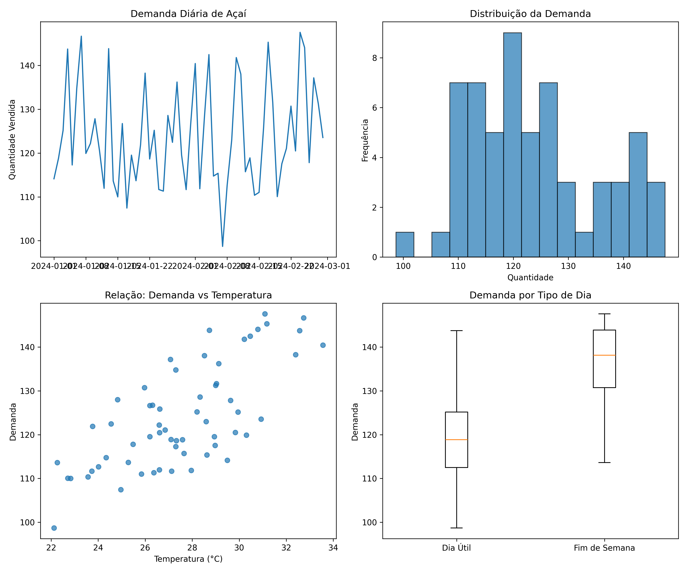

# Análise Estatística para Açaíteria

Código para análise estatística da açaíteria, utilizando os conceitos de estatística estudados na disciplina. O código inclui geração de dados simulados, análise exploratória, modelo de regressão linear e testes de hipótese.



Este código Python realiza uma análise estatística completa para a açaíteria, incluindo:

- Simulação de dados históricos de vendas considerando temperatura, fins de semana e feriados
- Análise exploratória com visualizações e estatísticas descritivas
- Teste de hipótese para verificar diferenças na demanda entre dias úteis e fins de semana
- Modelo de regressão linear para prever a demanda com base nas variáveis explicativas
- Previsões para os próximos 7 dias
- Recomendações práticas para gestão de estoque e redução de desperdícios

## Pré-requisitos

Para executar este código, você precisará das seguintes bibliotecas Python:

```bash
pip install pandas numpy matplotlib seaborn scipy scikit-learn statsmodels
```

## Arquivos Gerados

O código gerará três arquivos:

- `dados_acai_analisados.csv` - Os dados analisados
- `previsao_proximos_dias.csv` - Previsões para a próxima semana
- `analise_exploratoria.png` - Gráficos de análise exploratória

## Como executar

```bash
python3 analise_acai.py
```

## Estrutura do Projeto

```
├── analise_acai.py          # Código principal
├── analise_exploratoria.png # Gráfico de análise
├── dados_acai_analisados.csv # Dados analisados
├── previsao_proximos_dias.csv # Previsões futuras
└── README.md               # Este arquivo
```
